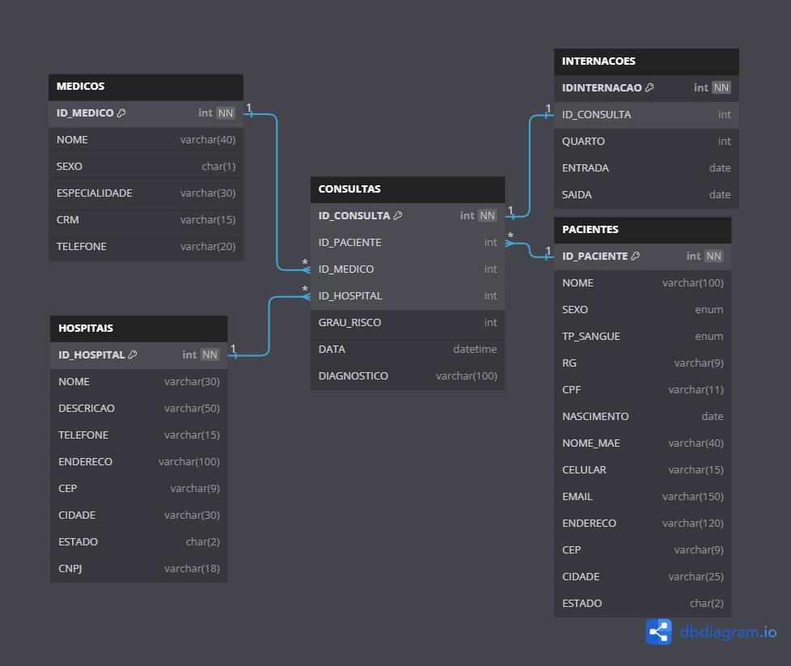

## Introdução

Esse projeto surgiu da minha necessidade de por em prática conteúdos estudados ao longo do tempo como SQL, Python, Cloud (AWS), PySpark e tipos de arquivos (JSON, CSV, Parquet). Nele eu simulei a criação de um banco de dados transacional para uma pequena empresa de saúde que conta com dois hospitais de médio porte na capital mineira Belo Horizonte. Abaixo segue uma descrição das três etapas da modelagem de dados seguidas nesse projeto:

* **Modelo conceitual** - Aqui é onde nasce tudo, o responsável pela modelagem e implantação deve estar em contato contínuo com o usuário final e ou área de negócio, apurando como se dá o surgimento dos dados e quais as regras de negócio ali aplicadas, os processos e as necessidades, ou seja, basicamente aprender como funcionam as coisas ali naquela organização. Todas as demandas e regras aplicadas devem ser documentadas para utilização posterior, é de suma importância ouvir todos que fazem parte da rotina operacional, e quanto mais informação melhor! E lembre-se sua principal finalidade é capturar os requisitos de informação e regras de negócio sob o ponto de vista do negócio, nada de falar de tecnologia ainda!

* **Modelo lógico** - Depois de compilar os requisitos do negócio, nessa etapa já começamos a pensar em chaves primárias, chaves estrangeiras e todo o esboço do modelo, aqui a modelagem é mais detalhada. Descrever com os dados serão armazenados e seus relacionamentos é importante, pois nesse nível as regras de integridade e normalização são estabelecidas para garantir a consistência dos dados. Aqui já são feitos rabiscos do diagrama do nosso banco, mas calma lá! Não necessariamente já definimos a tecnologia aqui, e tão pouco já é feita a criação do banco de dados.

* **Modelo físico** - Agora sim temos que definir uma tecnologia para implementar o que foi decidido no modelo lógico, ela é a representação física de tudo que foi definido antes. É importante escolher um banco de dados que se adapte e suporte as necessidades do negócio, levando em consideração os detalhes técnicos e de desempenho. E nosso caso especifico, decidimos por utilizar o SGBD MySQL!

Depois de finalizando o modelo físico esse foi o resultado, o catálogo dos dados pode ser visto [aqui](https://github.com/ViniciusFCarneiro/Medland_Project/tree/main/data-catalog). Os notebooks contendo os códigos estão no repositório ['notebooks'](https://github.com/ViniciusFCarneiro/Medland_Project/tree/main/src) algumas tabelas foram tratadas com Python e inseridas via CRUD, as duas maiores são tratadas na AWS. As queries SQL realizadas estão armazenadas no ['queries-sql'](https://github.com/ViniciusFCarneiro/Medland_Project/tree/main/queries-sql).
 


## Estruturas de pastas do repositório

```
project
|   Readme.md
└───data-catalog
|   |   Readme.md
|   |   consultas.csv
|   |   internacoes.csv
|   |   medicos.txt
|   |   pacientes_f.json
|   |   ...
└───img
|   |   AWS.drawio.png
|   |   DBeaver.png
|   |   ...
└───queries-sql
|   |   query.sql
|   |   Readme.md
└───src
|   |   1 - Medland.ipynb
|   |   JOB-1.ipynb
|   |   ...
```

## Pré-requisitos para execução desse projeto

- Python + libs (boto3, Pandas)
- Jupyter Nootebok (ou outro que abra arquivos .ipynb)
- Conta AWS

## Estrutura na AWS para processamento das tabelas (pacientes e consultas)


## Descrição dos serviços utilizados na nuvem

| Serviço      | Descrição                                                                                                                                                                                                                                                    |
| ------------ | ------------------------------------------------------------------------------------------------------------------------------------------------------------------------------------------------------------------------------------------------------------ |
| IAM          | Utilizado para gerenciamento de segurança, aqui configuramos as roles e policies para usuários e serviços que serão utilizados, dentre outras configurações relacionadas a segurança, sempre pensando no privilégio de acesso mínimo.                        |
| S3           | Serviço que oferece armazenamento altamente escalável e confiável, orientado a objetos.                                                                                                                                                                      |
| Glue Catalog | Repositório centralizado de metadados que descreve os dados disponíveis, esses geralmente rastreados por crawlers, facilitando a pesquisa, consulta e acesso aos dados de várias fontes em um único local.                                                   |
| Glue Crawler | Utilizamos esse serviço para examinar fontes de dados como arquivos em armazenamento S3, bancos de dados JDBC, tabelas do RDS dentre muitos outros, para extrair metadados e criar tabelas virtuais que permitem maior gerenciamento dos seus dados.         |
| Glue Job     | É um conjunto de instruções ETL que se conecta a dados de origem, processa-os e os grava em um destino de dados. Eles podem ser escritos em Python ou Scala e agendados para execução periódica ou desencadeados por eventos, como a chegada de novos dados. |
| CodeCommit   | Serviço de hospedagem de repositório de controle de versão, solução poderosa para gerenciamento de versão e colaboração no desenvolvimento.                                                                                                                  |
| Budgets      | Permite a definição de orçamentos com níveis diários, mensais e anuais. Também é possível configurar alertas de acordo com uma margem definida e verificar relatórios.                                                                                       |